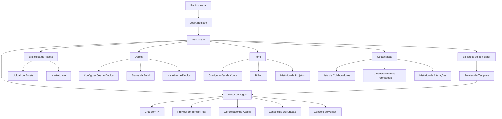

# Documento de Requisitos do Produto - INOX Game Creator

## 1. Visão Geral do Produto

INOX Game Creator é uma plataforma de desenvolvimento de jogos impulsionada por IA que permite criar, editar e implantar jogos através de interações em linguagem natural. A plataforma democratiza a criação de jogos, permitindo tanto agentes de IA quanto desenvolvedores humanos construírem experiências de jogos complexas sem conhecimento técnico prévio.

O produto resolve o problema da barreira de entrada técnica na criação de jogos, permitindo que criadores de jogos, desenvolvedores independentes e entusiastas transformem suas ideias em jogos funcionais em minutos. A plataforma utiliza IA avançada para entender as intenções do usuário, gerar código, criar assets e gerenciar todo o ciclo de vida do desenvolvimento.

## 2. Funcionalidades Principais

### 2.1 Papéis de Usuário

| Papel | Método de Registro | Permissões Principais |
|-------|-------------------|----------------------|
| Usuário Humano | Email/Senha, OAuth (Google, GitHub) | Criar/editar projetos, usar IA, fazer deploy, colaborar |
| Agente de IA | API Key + Autenticação programática | Criar/editar projetos programaticamente, acessar APIs |
| Admin | Convite de administrador existente | Gerenciar usuários, configurar plataforma, moderar conteúdo |

### 2.2 Módulo de Funcionalidades

Os requisitos consistem nas seguintes páginas principais:

1. **Página Inicial**: Seção hero, navegação, demonstração interativa, planos e preços.
2. **Dashboard**: Visão geral de projetos, estatísticas de uso, projetos recentes, acesso rápido.
3. **Editor de Jogos**: Editor de código, preview em tempo real, chat com IA, gerenciamento de assets.
4. **Biblioteca de Templates**: Galeria de templates, filtros por categoria, preview de templates, sistema de busca.
5. **Biblioteca de Assets**: Upload de assets, categorização, preview, download, marketplace.
6. **Página de Deploy**: Configurações de deployment, opções de plataforma, status de build, logs.
7. **Página de Perfil**: Informações do usuário, configurações de conta, histórico de projetos, billing.
8. **Página de Colaboração**: Lista de colaboradores, gerenciamento de permissões, histórico de alterações.

### 2.3 Detalhes das Páginas

| Nome da Página | Nome do Módulo | Descrição da Funcionalidade |
|---------------|---------------|---------------------------|
| Página Inicial | Seção Hero | Apresenta visão geral da plataforma com animações interativas e chamada para ação clara |
| Página Inicial | Demonstração Interativa | Demo em tempo real mostrando criação de jogo com IA em 30 segundos |
| Página Inicial | Planos e Preços | Exibe planos de subscrição com recursos e limitações de cada plano |
| Dashboard | Visão Geral de Projetos | Mostra cards com projetos recentes, status e métricas de uso |
| Dashboard | Estatísticas de Uso | Exibe gráficos de uso de tokens, tempo de desenvolvimento, jogos criados |
| Dashboard | Acesso Rápido | Atalhos para criar novo projeto, abrir projeto recente, acessar templates |
| Editor de Jogos | Editor de Código | Editor Monaco com syntax highlighting, completamento de código IA, linting |
| Editor de Jogos | Preview em Tempo Real | Renderização do jogo em canvas WebGL com hot reload automático |
| Editor de Jogos | Chat com IA | Interface de chat para conversar com assistente IA, gerar código, resolver problemas |
| Editor de Jogos | Gerenciador de Assets | Painel lateral para adicionar, editar e gerenciar sprites, sons, modelos 3D |
| Editor de Jogos | Console de Depuração | Console JavaScript integrado com logs, breakpoints e inspeção de variáveis |
| Editor de Jogos | Controle de Versão | Interface Git integrada com commits, branches, pull requests |
| Biblioteca de Templates | Galeria de Templates | Grid visual de templates com thumbnails, categorias e descrições |
| Biblioteca de Templates | Filtros e Busca | Sistema de filtragem por gênero, plataforma, complexidade, popularidade |
| Biblioteca de Templates | Preview de Templates | Modal com detalhes do template, screenshots, requisitos técnicos |
| Biblioteca de Templates | Uso de Template | Opção de clonar template para novo projeto com personalização inicial |
| Biblioteca de Assets | Upload de Assets | Interface drag-and-drop para upload de sprites, sons, modelos 3D |
| Biblioteca de Assets | Categorização | Sistema de tags e categorias para organizar assets |
| Biblioteca de Assets | Preview de Assets | Visualizador interativo para preview de assets antes de usar |
| Biblioteca de Assets | Download/Export | Opção de baixar assets individualmente ou em pacotes |
| Biblioteca de Assets | Marketplace (Opcional) | Loja de assets de terceiros com sistema de compras e reviews |
| Página de Deploy | Configurações de Deploy | Formulário para configurar plataforma, build settings, ambiente |
| Página de Deploy | Opções de Plataforma | Seleção de plataforma: Web (HTML5), Desktop (Windows/Mac/Linux), Mobile (iOS/Android) |
| Página de Deploy | Status de Build | Visualização em tempo real do progresso de build, logs, warnings, errors |
| Página de Deploy | Histórico de Deploy | Lista de builds anteriores com opção de rollback |
| Página de Perfil | Informações do Usuário | Formulário para editar nome, email, avatar, bio |
| Página de Perfil | Configurações de Conta | Opções de senha, 2FA, notificações, privacidade |
| Página de Perfil | Histórico de Projetos | Timeline com todos os projetos criados, editados e deletados |
| Página de Perfil | Billing e Assinatura | Informações de plano atual, histórico de pagamentos, método de pagamento |
| Página de Login | Formulário de Login | Campos de email/senha, opção "lembrar", recuperação de senha |
| Página de Registro | Formulário de Registro | Campos de nome, email, senha, confirmação de senha, termos de uso |
| Página de Colaboração | Lista de Colaboradores | Tabela com usuários convidados, status de convite, nível de permissão |
| Página de Colaboração | Gerenciamento de Permissões | Controles para definir níveis de acesso: viewer, editor, admin |
| Página de Colaboração | Histórico de Alterações | Timeline de commits, pull requests e alterações no projeto |

## 3. Processos Principais

### Fluxo de Usuário Humano

1. O usuário acessa a página inicial e cria uma conta
2. No dashboard, clica em "Novo Projeto"
3. Escolhe um template ou descreve seu jogo em linguagem natural no chat com IA
4. A IA gera a estrutura inicial do projeto, código e assets
5. O usuário entra no editor de jogos e vê o preview em tempo real
6. Utiliza o chat com IA para fazer ajustes e adicionar funcionalidades
7. Adiciona assets personalizados da biblioteca
8. Faz commit das alterações no controle de versão
9. Clica em "Deploy" e configura as opções de plataforma
10. Aguarda o build e recebe o link para o jogo publicado

### Fluxo de Agente de IA

1. O agente de IA se autentica via API Key
2. Faz uma requisição POST para criar um novo projeto
3. Envia descrição do jogo em linguagem natural ou especificações técnicas
4. Recebe project_id e URLs para editar o projeto
5. Faz upload de assets via API
6. Envia comandos de edição para modificar código
7. Solicita deploy via API com configurações de plataforma
8. Recebe URLs de deploy e status do build
9. Monitora status via webhooks ou polling

### Fluxo de Colaboração

1. Um usuário cria um projeto e define como colaborativo
2. Convida outros usuários via email
3. Os convidados recebem email e aceitam o convite
4. Cada colaborador acessa o projeto com permissões definidas
5. A plataforma sincroniza alterações em tempo real
6. Colaboradores usam o chat integrado para comunicação
7. O controle de versão rastreia contribuições de cada usuário
8. Deploy é feito por usuários com permissões de admin/editor

### Diagrama de Navegação

## 4. Design da Interface do Usuário

### 4.1 Estilo de Design

- **Cores Primárias**: Dark mode com gradientes neon (roxo #8B5CF6, azul #3B82F6, ciano #06B6D4)
- **Cores Secundárias**: Fundo escuro (#0F172A), cards semi-transparentes (rgba(30, 41, 59, 0.8))
- **Botões**: Estilo 3D sutil com hover effects, bordas arredondadas (8px), sombras coloridas
- **Fontes**: Inter (16px base, 14px texto secundário, 18px títulos, 24px headings principais)
- **Layout**: Baseado em cards com grid responsivo, sidebar de navegação fixa
- **Ícones**: Phosphor Icons ou Lucide Icons (outline style, tamanho consistente)
- **Animações**: Transições suaves (0.3s), micro-interações, loading states com spinners
- **Glassmorphism**: Efeitos de vidro fosco em cards e modais
- **Acessibilidade**: Contraste WCAG AA, foco visível, suporte a leitor de tela

### 4.2 Visão Geral do Design das Páginas

| Nome da Página | Nome do Módulo | Elementos de UI |
|---------------|---------------|----------------|
| Página Inicial | Seção Hero | Background animado com partículas, título grande com gradiente, CTA buttons com glow effect, animações de scroll |
| Dashboard | Visão Geral | Grid de cards com sombras, ícones coloridos, badges de status, sparkline charts |
| Editor de Jogos | Editor de Código | Tema dark (Dracula ou One Dark), linha de números, minimapa, autocomplete dropdown |
| Editor de Jogos | Preview | Canvas WebGL centralizado, controles de zoom/pan, toolbar de ferramentas |
| Editor de Jogos | Chat com IA | Interface estilo chatbot, bubbles de mensagem coloridos, typing indicator, markdown rendering |
| Biblioteca de Templates | Galeria | Grid responsivo (2-4 colunas), cards com hover effects, badges de categoria, rating stars |
| Biblioteca de Assets | Upload | Dropzone com borda tracejada, preview thumbnails, barra de progresso, drag handles |
| Página de Deploy | Configurações | Formulário com fieldsets, toggle switches, selects estilizados, botões de ação |
| Página de Perfil | Informações | Avatar circular com upload, campos de formulário limpos, tabs para seções |

### 4.3 Responsividade

- **Desktop-first**: Design otimizado para telas acima de 1440px
- **Adaptativo**: Breakpoints em 1024px (tablet), 768px (tablet pequeno), 480px (mobile)
- **Touch optimization**: Botões grandes (min 44px), gestos de swipe em carrosséis, haptic feedback em mobile
- **Performance**: Lazy loading de imagens, code splitting, otimização de assets
- **Mobile features**: Bottom navigation bar em mobile, swipe gestures, PWA support

## 5. Requisitos Não-Funcionais

### 5.1 Performance
- Tempo de carregamento inicial < 3 segundos
- Preview de jogo em tempo real com < 100ms de latência
- Suporte a projetos com até 10.000 arquivos

### 5.2 Segurança
- Criptografia de dados em repouso (AES-256)
- HTTPS obrigatório em todas as requisições
- Rate limiting em APIs públicas
- Proteção contra XSS, CSRF e SQL injection

### 5.3 Escalabilidade
- Arquitetura serverless para auto-scaling
- CDN para assets estáticos
- Cache de respostas de IA para reduzir custos

### 5.4 Disponibilidade
- Uptime de 99.5%
- Backups diários automáticos
- Sistema de monitoramento e alertas

### 5.5 Compatibilidade
- Suporte aos principais navegadores: Chrome, Firefox, Safari, Edge (últimas 2 versões)
- Suporte a WebGL 2.0
- Progressive Web App (PWA) para experiência offline
