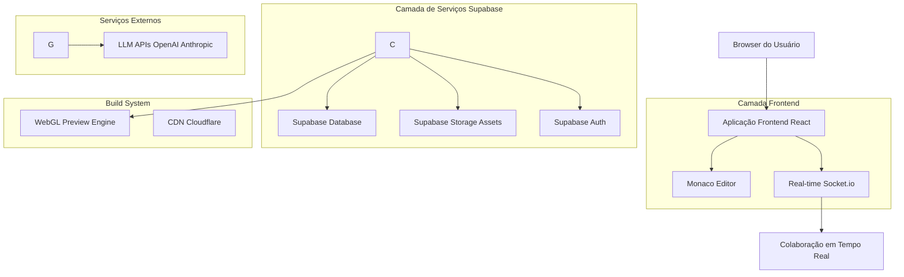
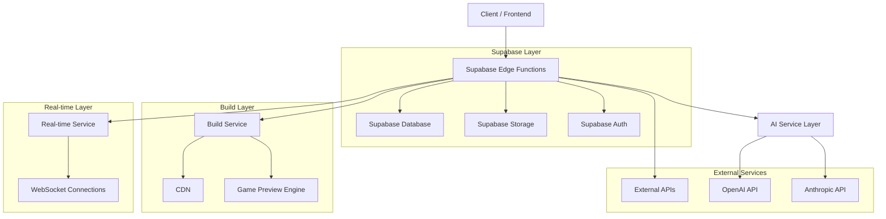
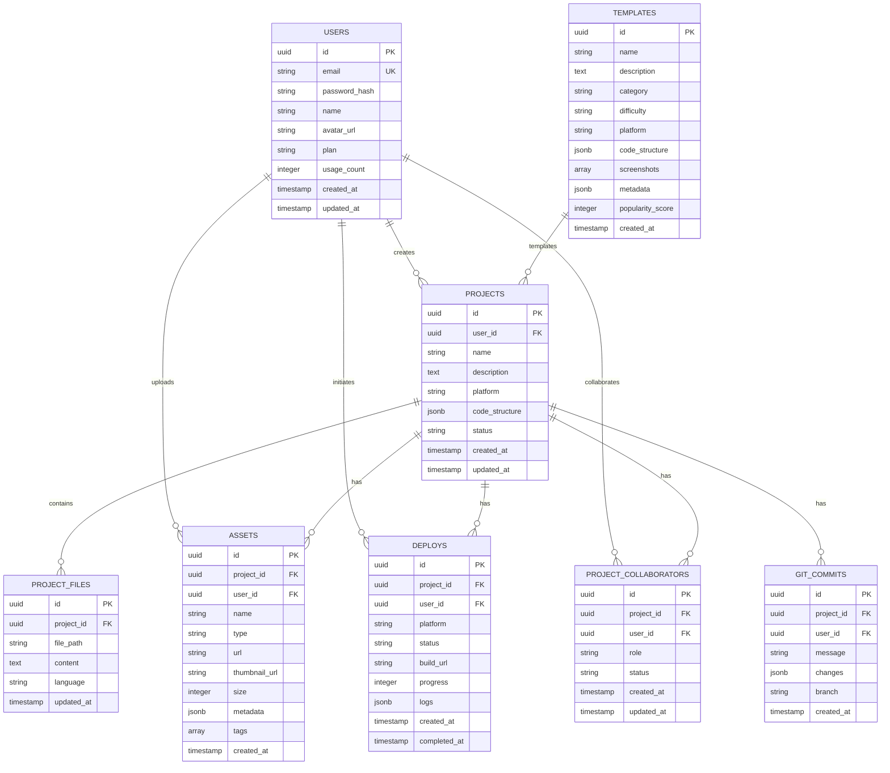

# Documento de Arquitetura Técnica - INOX Game Creator

## 1. Design da Arquitetura



## 2. Descrição Tecnológica

### 2.1 Stack Tecnológico Principal

- **Frontend**: React@18 + TypeScript@5 + Vite@5 + TailwindCSS@3
- **UI Components**: Radix UI + Framer Motion (animações)
- **Editor de Código**: Monaco Editor (VS Code editor)
- **State Management**: Zustand@4 (gerenciamento de estado global)
- **Real-time**: Socket.io-client para colaboração
- **Backend**: Supabase (PostgreSQL + Auth + Storage + Edge Functions)
- **AI Integration**: SDK OpenAI + Anthropic Claude
- **Build System**: Vite para builds de produção
- **CDN**: Cloudflare para assets estáticos e cache
- **Deploy**: Vercel (frontend) + Supabase (backend)

### 2.2 Dependências Essenciais

```json
{
  "dependencies": {
    "react": "^18.2.0",
    "react-dom": "^18.2.0",
    "typescript": "^5.3.0",
    "vite": "^5.0.0",
    "tailwindcss": "^3.4.0",
    "@supabase/supabase-js": "^2.39.0",
    "@monaco-editor/react": "^4.6.0",
    "zustand": "^4.4.7",
    "socket.io-client": "^4.6.0",
    "framer-motion": "^10.16.0",
    "@radix-ui/react-*": "^1.0.0",
    "openai": "^4.20.0",
    "@anthropic-ai/sdk": "^0.9.0",
    "three": "^0.160.0",
    "react-three-fiber": "^8.15.0"
  }
}
```

## 3. Definições de Rotas

| Rota | Propósito |
|------|-----------|
| `/` | Página inicial com hero section e demonstração |
| `/dashboard` | Dashboard principal do usuário |
| `/editor/:projectId` | Editor de jogos com preview em tempo real |
| `/templates` | Biblioteca de templates de jogos |
| `/assets` | Biblioteca de assets pessoais e marketplace |
| `/deploy/:projectId` | Configuração e status de deployment |
| `/profile` | Perfil e configurações do usuário |
| `/collaboration/:projectId` | Gerenciamento de colaboradores |
| `/login` | Página de login |
| `/register` | Página de registro |
| `/pricing` | Planos e preços |
| `/api/*` | Rotas de API (proxied via Supabase Edge Functions) |

## 4. Definições de APIs

### 4.1 API de Autenticação

#### POST /api/auth/register
Registro de novo usuário

Request:
| Nome do Parâmetro | Tipo | Obrigatório | Descrição |
|------------------|------|-------------|-----------|
| email | string | true | Email do usuário |
| password | string | true | Senha (mínimo 8 caracteres) |
| name | string | true | Nome completo do usuário |
| plan | string | false | Plano inicial (default: 'free') |

Response:
| Nome do Parâmetro | Tipo | Descrição |
|------------------|------|-----------|
| success | boolean | Status do registro |
| user_id | string | ID do usuário criado |
| session | object | Sessão de autenticação |

Example:
```json
{
  "email": "usuario@exemplo.com",
  "password": "senhaSegura123",
  "name": "João Silva",
  "plan": "free"
}
```

#### POST /api/auth/login
Login de usuário existente

Request:
| Nome do Parâmetro | Tipo | Obrigatório | Descrição |
|------------------|------|-------------|-----------|
| email | string | true | Email do usuário |
| password | string | true | Senha do usuário |

Response:
| Nome do Parâmetro | Tipo | Descrição |
|------------------|------|-----------|
| success | boolean | Status do login |
| user | object | Dados do usuário |
| access_token | string | Token de acesso JWT |

### 4.2 API de Projetos

#### POST /api/projects
Criar novo projeto de jogo

Request:
| Nome do Parâmetro | Tipo | Obrigatório | Descrição |
|------------------|------|-------------|-----------|
| name | string | true | Nome do projeto |
| description | string | false | Descrição do projeto |
| template_id | string | false | ID do template base (opcional) |
| ai_prompt | string | false | Prompt para IA gerar código inicial |
| platform | string | true | Plataforma alvo (web/desktop/mobile) |

Response:
| Nome do Parâmetro | Tipo | Descrição |
|------------------|------|-----------|
| project_id | string | ID do projeto criado |
| status | string | Status do projeto |
| created_at | string | Timestamp de criação |

#### GET /api/projects/:id
Obter detalhes do projeto

Response:
| Nome do Parâmetro | Tipo | Descrição |
|------------------|------|-----------|
| project_id | string | ID do projeto |
| name | string | Nome do projeto |
| description | string | Descrição |
| code | object | Estrutura de código do projeto |
| assets | array | Lista de assets do projeto |
| created_at | string | Data de criação |
| updated_at | string | Última atualização |

#### PUT /api/projects/:id
Atualizar projeto

Request:
| Nome do Parâmetro | Tipo | Obrigatório | Descrição |
|------------------|------|-------------|-----------|
| name | string | false | Novo nome do projeto |
| description | string | false | Nova descrição |
| code | object | false | Nova estrutura de código |
| assets | array | false | Nova lista de assets |

#### DELETE /api/projects/:id
Deletar projeto

Response:
| Nome do Parâmetro | Tipo | Descrição |
|------------------|------|-----------|
| success | boolean | Status da exclusão |
| message | string | Mensagem de confirmação |

### 4.3 API de IA

#### POST /api/ai/generate-code
Gerar código de jogo via IA

Request:
| Nome do Parâmetro | Tipo | Obrigatório | Descrição |
|------------------|------|-------------|-----------|
| prompt | string | true | Descrição do jogo em linguagem natural |
| project_id | string | true | ID do projeto |
| model | string | false | Modelo de IA a usar (default: 'gpt-4') |
| template_id | string | false | ID do template base |

Response:
| Nome do Parâmetro | Tipo | Descrição |
|------------------|------|-----------|
| code | object | Código gerado estruturado |
| assets | array | Lista de assets sugeridos |
| explanation | string | Explicação do código gerado |
| tokens_used | number | Tokens consumidos |

#### POST /api/ai/modify-code
Modificar código existente via IA

Request:
| Nome do Parâmetro | Tipo | Obrigatório | Descrição |
|------------------|------|-------------|-----------|
| project_id | string | true | ID do projeto |
| current_code | object | true | Código atual |
| modification_request | string | true | Solicitação de modificação |
| file_path | string | false | Caminho do arquivo a modificar |

Response:
| Nome do Parâmetro | Tipo | Descrição |
|------------------|------|-----------|
| modified_code | object | Código modificado |
| changes | array | Lista de alterações realizadas |
| explanation | string | Explicação das modificações |

#### POST /api/ai/chat
Chat com assistente de IA

Request:
| Nome do Parâmetro | Tipo | Obrigatório | Descrição |
|------------------|------|-------------|-----------|
| project_id | string | true | ID do projeto contexto |
| message | string | true | Mensagem do usuário |
| conversation_history | array | false | Histórico da conversa |

Response:
| Nome do Parâmetro | Tipo | Descrição |
|------------------|------|-----------|
| response | string | Resposta da IA |
| code_snippets | array | Snippets de código sugeridos |
| suggested_actions | array | Ações sugeridas |

### 4.4 API de Assets

#### POST /api/assets/upload
Upload de asset

Request:
| Nome do Parâmetro | Tipo | Obrigatório | Descrição |
|------------------|------|-------------|-----------|
| project_id | string | true | ID do projeto |
| file | File | true | Arquivo a fazer upload |
| type | string | true | Tipo (sprite/model/sound/music) |
| tags | array | false | Tags para categorização |

Response:
| Nome do Parâmetro | Tipo | Descrição |
|------------------|------|-----------|
| asset_id | string | ID do asset |
| url | string | URL pública do asset |
| thumbnail_url | string | URL do thumbnail |
| size | number | Tamanho em bytes |

#### GET /api/assets/:id
Obter detalhes do asset

Response:
| Nome do Parâmetro | Tipo | Descrição |
|------------------|------|-----------|
| asset_id | string | ID do asset |
| name | string | Nome do asset |
| type | string | Tipo do asset |
| url | string | URL pública |
| thumbnail_url | string | URL do thumbnail |
| metadata | object | Metadados do asset |

#### DELETE /api/assets/:id
Deletar asset

Response:
| Nome do Parâmetro | Tipo | Descrição |
|------------------|------|-----------|
| success | boolean | Status da exclusão |

### 4.5 API de Deploy

#### POST /api/deploy/:projectId
Iniciar deployment do projeto

Request:
| Nome do Parâmetro | Tipo | Obrigatório | Descrição |
|------------------|------|-------------|-----------|
| platform | string | true | Plataforma alvo |
| build_config | object | false | Configurações específicas do build |
| environment | string | false | Ambiente (development/production) |

Response:
| Nome do Parâmetro | Tipo | Descrição |
|------------------|------|-----------|
| build_id | string | ID do build |
| status | string | Status inicial (queued) |
| estimated_time | number | Tempo estimado em segundos |

#### GET /api/deploy/:buildId
Obter status do build

Response:
| Nome do Parâmetro | Tipo | Descrição |
|------------------|------|-----------|
| build_id | string | ID do build |
| status | string | Status (queued/building/succeeded/failed) |
| progress | number | Progresso (0-100) |
| logs | array | Logs do build |
| deploy_url | string | URL do deployment (se concluído) |

### 4.6 API de Colaboração

#### POST /api/projects/:id/collaborators
Adicionar colaborador ao projeto

Request:
| Nome do Parâmetro | Tipo | Obrigatório | Descrição |
|------------------|------|-------------|-----------|
| email | string | true | Email do colaborador |
| role | string | true | Nível de permissão (viewer/editor/admin) |

Response:
| Nome do Parâmetro | Tipo | Descrição |
|------------------|------|-----------|
| invitation_id | string | ID do convite |
| status | string | Status (pending/accepted) |

#### GET /api/projects/:id/collaborators
Listar colaboradores do projeto

Response:
| Nome do Parâmetro | Tipo | Descrição |
|------------------|------|-----------|
| collaborators | array | Lista de colaboradores |
| pending_invitations | array | Lista de convites pendentes |

#### DELETE /api/projects/:id/collaborators/:userId
Remover colaborador do projeto

Response:
| Nome do Parâmetro | Tipo | Descrição |
|------------------|------|-----------|
| success | boolean | Status da remoção |

### 4.7 API de Templates

#### GET /api/templates
Listar templates disponíveis

Query Parameters:
| Nome do Parâmetro | Tipo | Obrigatório | Descrição |
|------------------|------|-------------|-----------|
| category | string | false | Filtrar por categoria |
| platform | string | false | Filtrar por plataforma |
| difficulty | string | false | Filtrar por dificuldade |

Response:
| Nome do Parâmetro | Tipo | Descrição |
|------------------|------|-----------|
| templates | array | Lista de templates |
| total | number | Total de templates |

#### GET /api/templates/:id
Obter detalhes do template

Response:
| Nome do Parâmetro | Tipo | Descrição |
|------------------|------|-----------|
| template_id | string | ID do template |
| name | string | Nome do template |
| description | string | Descrição |
| category | string | Categoria |
| difficulty | string | Nível de dificuldade |
| screenshots | array | URLs de screenshots |
| features | array | Lista de funcionalidades |
| requirements | object | Requisitos técnicos |

## 5. Diagrama de Arquitetura de Servidor



## 6. Modelo de Dados

### 6.1 Definição do Modelo de Dados



### 6.2 Linguagem de Definição de Dados (DDL)

#### Tabela de Usuários
```sql
-- create table
CREATE TABLE users (
    id UUID PRIMARY KEY DEFAULT gen_random_uuid(),
    email VARCHAR(255) UNIQUE NOT NULL,
    password_hash VARCHAR(255) NOT NULL,
    name VARCHAR(100) NOT NULL,
    avatar_url TEXT,
    plan VARCHAR(20) DEFAULT 'free' CHECK (plan IN ('free', 'pro', 'enterprise')),
    usage_count INTEGER DEFAULT 0,
    created_at TIMESTAMP WITH TIME ZONE DEFAULT NOW(),
    updated_at TIMESTAMP WITH TIME ZONE DEFAULT NOW()
);

-- create index
CREATE INDEX idx_users_email ON users(email);
CREATE INDEX idx_users_plan ON users(plan);
CREATE INDEX idx_users_created_at ON users(created_at DESC);

-- grant permissions
GRANT SELECT ON users TO anon;
GRANT ALL PRIVILEGES ON users TO authenticated;
```

#### Tabela de Projetos
```sql
-- create table
CREATE TABLE projects (
    id UUID PRIMARY KEY DEFAULT gen_random_uuid(),
    user_id UUID NOT NULL REFERENCES users(id) ON DELETE CASCADE,
    name VARCHAR(255) NOT NULL,
    description TEXT,
    platform VARCHAR(50) NOT NULL CHECK (platform IN ('web', 'desktop', 'mobile', 'all')),
    code_structure JSONB DEFAULT '{}',
    status VARCHAR(20) DEFAULT 'draft' CHECK (status IN ('draft', 'active', 'archived')),
    created_at TIMESTAMP WITH TIME ZONE DEFAULT NOW(),
    updated_at TIMESTAMP WITH TIME ZONE DEFAULT NOW()
);

-- create index
CREATE INDEX idx_projects_user_id ON projects(user_id);
CREATE INDEX idx_projects_status ON projects(status);
CREATE INDEX idx_projects_platform ON projects(platform);
CREATE INDEX idx_projects_created_at ON projects(created_at DESC);

-- grant permissions
GRANT SELECT ON projects TO anon;
GRANT ALL PRIVILEGES ON projects TO authenticated;
```

#### Tabela de Arquivos de Projeto
```sql
-- create table
CREATE TABLE project_files (
    id UUID PRIMARY KEY DEFAULT gen_random_uuid(),
    project_id UUID NOT NULL REFERENCES projects(id) ON DELETE CASCADE,
    file_path VARCHAR(500) NOT NULL,
    content TEXT NOT NULL,
    language VARCHAR(50),
    updated_at TIMESTAMP WITH TIME ZONE DEFAULT NOW(),
    UNIQUE(project_id, file_path)
);

-- create index
CREATE INDEX idx_project_files_project_id ON project_files(project_id);
CREATE INDEX idx_project_files_file_path ON project_files(file_path);

-- grant permissions
GRANT SELECT ON project_files TO anon;
GRANT ALL PRIVILEGES ON project_files TO authenticated;
```

#### Tabela de Assets
```sql
-- create table
CREATE TABLE assets (
    id UUID PRIMARY KEY DEFAULT gen_random_uuid(),
    project_id UUID NOT NULL REFERENCES projects(id) ON DELETE CASCADE,
    user_id UUID NOT NULL REFERENCES users(id) ON DELETE CASCADE,
    name VARCHAR(255) NOT NULL,
    type VARCHAR(50) NOT NULL CHECK (type IN ('sprite', 'model', 'sound', 'music', 'font', 'other')),
    url TEXT NOT NULL,
    thumbnail_url TEXT,
    size INTEGER NOT NULL,
    metadata JSONB DEFAULT '{}',
    tags TEXT[] DEFAULT '{}',
    created_at TIMESTAMP WITH TIME ZONE DEFAULT NOW()
);

-- create index
CREATE INDEX idx_assets_project_id ON assets(project_id);
CREATE INDEX idx_assets_user_id ON assets(user_id);
CREATE INDEX idx_assets_type ON assets(type);
CREATE INDEX idx_assets_tags ON assets USING GIN(tags);

-- grant permissions
GRANT SELECT ON assets TO anon;
GRANT ALL PRIVILEGES ON assets TO authenticated;
```

#### Tabela de Deploys
```sql
-- create table
CREATE TABLE deploys (
    id UUID PRIMARY KEY DEFAULT gen_random_uuid(),
    project_id UUID NOT NULL REFERENCES projects(id) ON DELETE CASCADE,
    user_id UUID NOT NULL REFERENCES users(id) ON DELETE CASCADE,
    platform VARCHAR(50) NOT NULL CHECK (platform IN ('web', 'desktop', 'mobile')),
    status VARCHAR(20) DEFAULT 'queued' CHECK (status IN ('queued', 'building', 'succeeded', 'failed', 'cancelled')),
    build_url TEXT,
    progress INTEGER DEFAULT 0 CHECK (progress >= 0 AND progress <= 100),
    logs JSONB DEFAULT '[]',
    build_config JSONB DEFAULT '{}',
    created_at TIMESTAMP WITH TIME ZONE DEFAULT NOW(),
    completed_at TIMESTAMP WITH TIME ZONE
);

-- create index
CREATE INDEX idx_deploys_project_id ON deploys(project_id);
CREATE INDEX idx_deploys_user_id ON deploys(user_id);
CREATE INDEX idx_deploys_status ON deploys(status);
CREATE INDEX idx_deploys_created_at ON deploys(created_at DESC);

-- grant permissions
GRANT SELECT ON deploys TO anon;
GRANT ALL PRIVILEGES ON deploys TO authenticated;
```

#### Tabela de Colaboradores
```sql
-- create table
CREATE TABLE project_collaborators (
    id UUID PRIMARY KEY DEFAULT gen_random_uuid(),
    project_id UUID NOT NULL REFERENCES projects(id) ON DELETE CASCADE,
    user_id UUID NOT NULL REFERENCES users(id) ON DELETE CASCADE,
    role VARCHAR(20) NOT NULL CHECK (role IN ('viewer', 'editor', 'admin')),
    status VARCHAR(20) DEFAULT 'pending' CHECK (status IN ('pending', 'accepted', 'declined')),
    created_at TIMESTAMP WITH TIME ZONE DEFAULT NOW(),
    updated_at TIMESTAMP WITH TIME ZONE DEFAULT NOW(),
    UNIQUE(project_id, user_id)
);

-- create index
CREATE INDEX idx_project_collaborators_project_id ON project_collaborators(project_id);
CREATE INDEX idx_project_collaborators_user_id ON project_collaborators(user_id);
CREATE INDEX idx_project_collaborators_status ON project_collaborators(status);

-- grant permissions
GRANT SELECT ON project_collaborators TO anon;
GRANT ALL PRIVILEGES ON project_collaborators TO authenticated;
```

#### Tabela de Commits Git
```sql
-- create table
CREATE TABLE git_commits (
    id UUID PRIMARY KEY DEFAULT gen_random_uuid(),
    project_id UUID NOT NULL REFERENCES projects(id) ON DELETE CASCADE,
    user_id UUID NOT NULL REFERENCES users(id) ON DELETE CASCADE,
    message TEXT NOT NULL,
    changes JSONB NOT NULL,
    branch VARCHAR(255) DEFAULT 'main',
    hash VARCHAR(64),
    created_at TIMESTAMP WITH TIME ZONE DEFAULT NOW()
);

-- create index
CREATE INDEX idx_git_commits_project_id ON git_commits(project_id);
CREATE INDEX idx_git_commits_user_id ON git_commits(user_id);
CREATE INDEX idx_git_commits_created_at ON git_commits(created_at DESC);
CREATE INDEX idx_git_commits_branch ON git_commits(branch);

-- grant permissions
GRANT SELECT ON git_commits TO anon;
GRANT ALL PRIVILEGES ON git_commits TO authenticated;
```

#### Tabela de Templates
```sql
-- create table
CREATE TABLE templates (
    id UUID PRIMARY KEY DEFAULT gen_random_uuid(),
    name VARCHAR(255) NOT NULL,
    description TEXT,
    category VARCHAR(50) NOT NULL,
    difficulty VARCHAR(20) CHECK (difficulty IN ('beginner', 'intermediate', 'advanced')),
    platform VARCHAR(50) CHECK (platform IN ('web', 'desktop', 'mobile', 'all')),
    code_structure JSONB NOT NULL,
    screenshots TEXT[] DEFAULT '{}',
    metadata JSONB DEFAULT '{}',
    popularity_score INTEGER DEFAULT 0,
    created_at TIMESTAMP WITH TIME ZONE DEFAULT NOW()
);

-- create index
CREATE INDEX idx_templates_category ON templates(category);
CREATE INDEX idx_templates_difficulty ON templates(difficulty);
CREATE INDEX idx_templates_platform ON templates(platform);
CREATE INDEX idx_templates_popularity ON templates(popularity_score DESC);

-- grant permissions
GRANT SELECT ON templates TO anon;
GRANT ALL PRIVILEGES ON templates TO authenticated;

-- init data
INSERT INTO templates (name, description, category, difficulty, platform, code_structure, screenshots, metadata, popularity_score) VALUES
('2D Platformer Básico', 'Template para jogos de plataforma 2D com física básica', 'platformer', 'beginner', 'web', '{"main": "index.html", "script": "game.js", "styles": "styles.css"}', ARRAY['/screenshots/platformer1.png', '/screenshots/platformer2.png'], '{"features": ["jump", "move", "collision"], "complexity": 1}', 150),
('RPG 3D Simples', 'Template para RPG 3D com câmera em terceira pessoa', 'rpg', 'intermediate', 'desktop', '{"main": "index.html", "script": "game.js", "styles": "styles.css", "models": ["player.glb", "world.glb"]}', ARRAY['/screenshots/rpg1.png', '/screenshots/rpg2.png'], '{"features": ["camera", "movement", "dialogue"], "complexity": 2}', 120),
('Jogo de Puzzle', 'Template para jogos de puzzle com sistema de níveis', 'puzzle', 'beginner', 'web', '{"main": "index.html", "script": "game.js", "styles": "styles.css"}', ARRAY['/screenshots/puzzle1.png'], '{"features": ["levels", "timer", "score"], "complexity": 1}', 200);
```

## 7. Estratégia de Deploy e Infraestrutura

### 7.1 Frontend Deployment
- **Plataforma**: Vercel
- **CI/CD**: GitHub Actions para builds automáticos
- **Ambientes**: Development, Staging, Production
- **Performance**: CDN global, edge caching, code splitting

### 7.2 Backend Deployment
- **Plataforma**: Supabase (managed PostgreSQL + Edge Functions)
- **Regions**: Multi-region para latência reduzida
- **Backup**: Daily backups com retenção de 30 dias
- **Monitoring**: Supabase dashboard + custom alerts

### 7.3 CDN e Assets
- **Provider**: Cloudflare CDN
- **Caching Strategy**: Cache headers otimizados para assets estáticos
- **Image Optimization**: WebP/AVIF formats com fallback
- **Video Streaming**: HLS para previews de jogos

### 7.4 Security & Compliance
- **HTTPS**: SSL automático via Vercel e Supabase
- **CORS**: Configurações restritivas para APIs
- **Rate Limiting**: 1000 requests/minute por usuário
- **Data Encryption**: At-rest e in-transit encryption

## 8. Monitoramento e Observabilidade

### 8.1 Logging
- **Application Logs**: Winston + Elasticsearch
- **Error Tracking**: Sentry
- **Performance Monitoring**: Vercel Analytics + Supabase metrics

### 8.2 Metrics
- **Key Metrics**: Uptime, response time, error rate, user engagement
- **Custom Metrics**: AI token usage, build success rate, collaboration sessions
- **Alerting**: PagerDuty para incidentes críticos

## 9. Escalabilidade e Performance

### 9.1 Horizontal Scaling
- **Frontend**: Auto-scaling via Vercel
- **Backend**: Supabase auto-scales database and edge functions
- **CDN**: Global edge network para assets

### 9.2 Caching Strategy
- **API Responses**: Redis cache para endpoints frequentes
- **Static Assets**: Long-term cache headers
- **AI Responses**: Cache de prompts similares para reduzir custos

### 9.3 Database Optimization
- **Read Replicas**: Para queries de leitura intensivas
- **Connection Pooling**: PgBouncer para gerenciar conexões
- **Query Optimization**: Índices e query tuning regular
