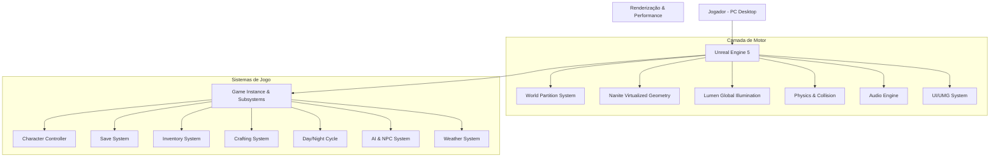
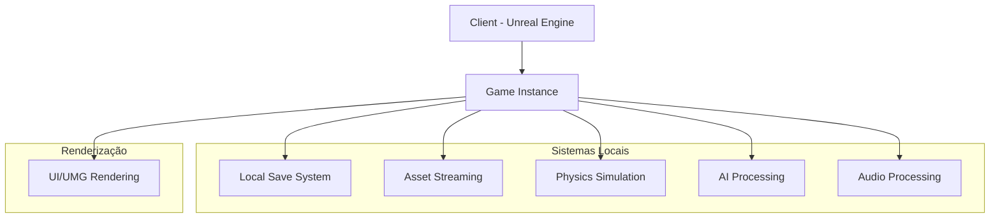
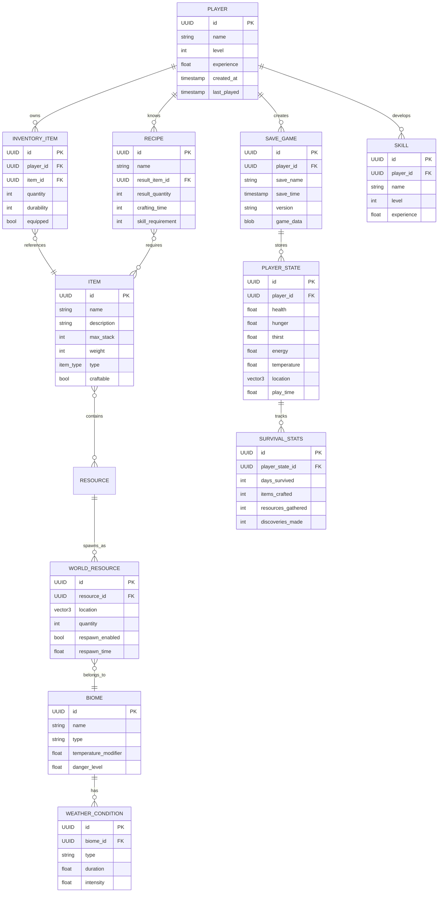

# Documento de Arquitetura Técnica - Jogo de Sobrevivência em Mundo Aberto

## 1. Design de Arquitetura



## 2. Descrição de Tecnologias

### 2.1 Tecnologias Principais
- **Motor de Jogo**: Unreal Engine 5.3+ (última versão estável)
- **Linguagem de Programação**: C++ (sistemas de núcleo) + Blueprints (lógica de gameplay)
- **Plataformas**: Windows 10/11, macOS 12+, Linux (Ubuntu 20.04+)
- **Gráficos**: DirectX 12 (Windows), Metal (macOS), Vulkan (Linux)

### 2.2 Dependências Essenciais
- **World Partition**: Sistema de particionamento de mundo para streaming eficiente
- **Nanite**: Geometria virtualizada para alto nível de detalhe
- **Lumen**: Iluminação global em tempo real
- **Chaos Physics**: Motor de física avançado
- **MetaSounds**: Sistema de áudio procedural
- **Control Rig**: Sistema de rigging e animação avançado

## 3. Definições de Rotas

O jogo não utiliza rotas web tradicionais, mas possui uma estrutura de mapas e níveis:

| Nível/Mapa | Propósito |
|------------|-----------|
| `/MainMenu` | Tela principal do jogo, menu de navegação |
| `/Game/Island_Main` | Mapa principal da ilha com world partition |
| `/Game/Interior_School` | Interior da escola (ponto inicial) |
| `/Game/Settings` | Menu de configurações do jogo |
| `/Game/PauseMenu` | Menu de pausa durante o gameplay |

## 4. Definições de API

O jogo utiliza principalmente sistemas internos do Unreal Engine, mas pode incluir APIs personalizadas:

### 4.1 API de Sistema de Jogo

**Gerenciamento de Estado do Jogador**
```
C++ API: PlayerStateComponent
```

Métodos principais:
| Nome do Método | Tipo de Retorno | Descrição |
|----------------|-----------------|-----------|
| UpdateSurvivalStats | void | Atualiza estatísticas de sobrevivência |
| GetHealthPercentage | float | Retorna porcentagem atual de vida |
| GetHungerLevel | float | Retorna nível atual de fome |
| ApplyDamage | void | Aplica dano ao jogador |
| ConsumeResource | bool | Consome recurso do inventário |

**Sistema de Inventário**
```
C++ API: InventoryComponent
```

Métodos principais:
| Nome do Método | Tipo de Retorno | Descrição |
|----------------|-----------------|-----------|
| AddItem | bool | Adiciona item ao inventário |
| RemoveItem | bool | Remove item do inventário |
| GetItemCount | int32 | Retorna quantidade de item específico |
| HasSpaceForItem | bool | Verifica espaço disponível |

**Sistema de Criação**
```
C++ API: CraftingComponent
```

Métodos principais:
| Nome do Método | Tipo de Retorno | Descrição |
|----------------|-----------------|-----------|
| CraftItem | bool | Cria item se materiais disponíveis |
| GetAvailableRecipes | TArray<FRecipeData> | Retorna receitas desbloqueadas |
| CanCraftItem | bool | Verifica se item pode ser criado |
| UnlockRecipe | void | Desbloqueia nova receita |

## 5. Diagrama de Arquitetura do Servidor



## 6. Modelo de Dados

### 6.1 Definição de Modelo de Dados



### 6.2 Definição de Linguagem de Dados

Embora o jogo use principalmente sistemas de dados do Unreal Engine, aqui estão as estruturas principais:

```cpp
// Estrutura de dados principal para jogador
USTRUCT(BlueprintType)
struct FPlayerData {
    GENERATED_BODY()

    UPROPERTY(EditAnywhere, BlueprintReadWrite)
    FString PlayerName;

    UPROPERTY(EditAnywhere, BlueprintReadWrite)
    int32 PlayerLevel = 1;

    UPROPERTY(EditAnywhere, BlueprintReadWrite)
    float Experience = 0.0f;

    UPROPERTY(EditAnywhere, BlueprintReadWrite)
    float Health = 100.0f;

    UPROPERTY(EditAnywhere, BlueprintReadWrite)
    float Hunger = 100.0f;

    UPROPERTY(EditAnywhere, BlueprintReadWrite)
    float Thirst = 100.0f;

    UPROPERTY(EditAnywhere, BlueprintReadWrite)
    float Energy = 100.0f;

    UPROPERTY(EditAnywhere, BlueprintReadWrite)
    float Temperature = 37.0f;

    UPROPERTY(EditAnywhere, BlueprintReadWrite)
    FVector PlayerLocation = FVector::ZeroVector;

    UPROPERTY(EditAnywhere, BlueprintReadWrite)
    float PlayTime = 0.0f;
};

// Estrutura para itens
UENUM(BlueprintType)
enum class EItemType : uint8 {
    Resource,
    Tool,
    Weapon,
    Armor,
    Consumable,
    Material,
    QuestItem
};

USTRUCT(BlueprintType)
struct FItemData {
    GENERATED_BODY()

    UPROPERTY(EditAnywhere, BlueprintReadWrite)
    FString ItemName;

    UPROPERTY(EditAnywhere, BlueprintReadWrite)
    FString Description;

    UPROPERTY(EditAnywhere, BlueprintReadWrite)
    EItemType ItemType;

    UPROPERTY(EditAnywhere, BlueprintReadWrite)
    int32 MaxStackSize = 1;

    UPROPERTY(EditAnywhere, BlueprintReadWrite)
    float Weight = 1.0f;

    UPROPERTY(EditAnywhere, BlueprintReadWrite)
    UTexture2D* Icon = nullptr;
};

// Estrutura para receitas de criação
USTRUCT(BlueprintType)
struct FRecipeRequirement {
    GENERATED_BODY()

    UPROPERTY(EditAnywhere, BlueprintReadWrite)
    FString ItemID;

    UPROPERTY(EditAnywhere, BlueprintReadWrite)
    int32 Quantity = 1;
};

USTRUCT(BlueprintType)
struct FRecipeData {
    GENERATED_BODY()

    UPROPERTY(EditAnywhere, BlueprintReadWrite)
    FString RecipeName;

    UPROPERTY(EditAnywhere, BlueprintReadWrite)
    FString ResultItemID;

    UPROPERTY(EditAnywhere, BlueprintReadWrite)
    int32 ResultQuantity = 1;

    UPROPERTY(EditAnywhere, BlueprintReadWrite)
    TArray<FRecipeRequirement> RequiredItems;

    UPROPERTY(EditAnywhere, BlueprintReadWrite)
    float CraftingTime = 1.0f;

    UPROPERTY(EditAnywhere, BlueprintReadWrite)
    int32 SkillLevelRequired = 1;
};

// Estrutura para estado de sobrevivência
USTRUCT(BlueprintType)
struct FSurvivalStats {
    GENERATED_BODY()

    UPROPERTY(EditAnywhere, BlueprintReadWrite)
    int32 DaysSurvived = 0;

    UPROPERTY(EditAnywhere, BlueprintReadWrite)
    int32 ItemsCrafted = 0;

    UPROPERTY(EditAnywhere, BlueprintReadWrite)
    int32 ResourcesGathered = 0;

    UPROPERTY(EditAnywhere, BlueprintReadWrite)
    int32 DiscoveriesMade = 0;

    UPROPERTY(EditAnywhere, BlueprintReadWrite)
    int32 EnemiesDefeated = 0;
};
```

## 7. Implementação de Sistemas Principais

### 7.1 Sistema de World Partition

**Configuração do Mundo**
- Divisão da ilha em células de 1km² para streaming eficiente
- Carregamento dinâmico baseado na posição do jogador
- Níveis de detalhe (LODs) para otimização de performance
- Sistema de HLODs (Hierarchical Level of Detail) para objetos distantes

**Configuração de Runtime Grid**
```cpp
// Configuração de World Partition no GameMode
virtual void InitGame(const FString& MapName, const FString& Options, FString& ErrorMessage) override {
    Super::InitGame(MapName, Options, ErrorMessage);
    
    // Configurar World Partition
    if (UWorld* World = GetWorld()) {
        if (UWorldPartition* WorldPartition = World->GetWorldPartition()) {
            WorldPartition->RuntimeGridCellSize = 1024; // 1km cells
            WorldPartition->DataLayersStreamingMode = EDataLayersStreamingMode::Runtime;
        }
    }
}
```

### 7.2 Sistema de Nanite e Lumen

**Implementação de Nanite**
- Conversão de ativos estáticos para Nanite meshes
- Configuração de LODs automáticos
- Otimização de clusters para performance
- Limitação de triângulos por frame para manter FPS estável

**Configuração de Lumen**
```cpp
// Configuração de Lumen no PostProcessVolume
// No Blueprint do PostProcess Volume:
// - Lumen Global Illumination: Enabled
// - Lumen Reflections: Enabled
// - Lumen Scene Lighting: Enabled
// - Software Ray Tracing: Enabled (para compatibilidade)

// Configuração de qualidade de Lumen
void ConfigureLumenQuality(ELumenQualityLevel QualityLevel) {
    switch(QualityLevel) {
        case ELumenQualityLevel::Low:
            // Reduzir número de samples, desativar algumas features
            break;
        case ELumenQualityLevel::Medium:
            // Configuração balanceada
            break;
        case ELumenQualityLevel::High:
            // Máxima qualidade com mais samples
            break;
    }
}
```

### 7.3 Sistema de Controlador de Personagem

**Implementação Básica**
```cpp
// ACharacterSurvival.h
UCLASS()
class SURVIVALGAME_API ACharacterSurvival : public ACharacter {
    GENERATED_BODY()

public:
    ACharacterSurvival();

protected:
    virtual void BeginPlay() override;

public:
    virtual void Tick(float DeltaTime) override;
    virtual void SetupPlayerInputComponent(class UInputComponent* PlayerInputComponent) override;

    // Movement
    void MoveForward(float Value);
    void MoveRight(float Value);
    void StartSprinting();
    void StopSprinting();

    // Interaction
    void Interact();
    void ToggleInventory();
    void ToggleCrafting();

    // Survival
    UPROPERTY(EditAnywhere, BlueprintReadWrite, Category = "Survival")
    float Health = 100.0f;

    UPROPERTY(EditAnywhere, BlueprintReadWrite, Category = "Survival")
    float Hunger = 100.0f;

    UPROPERTY(EditAnywhere, BlueprintReadWrite, Category = "Survival")
    float Thirst = 100.0f;

    UPROPERTY(EditAnywhere, BlueprintReadWrite, Category = "Survival")
    float Energy = 100.0f;

private:
    void UpdateSurvivalStats(float DeltaTime);
    bool bIsSprinting = false;
    float SprintSpeedMultiplier = 1.5f;
    float BaseWalkSpeed = 400.0f;
};
```

### 7.4 Sistema de Dia/Noite

**Implementação do Ciclo**
```cpp
// ADayNightCycleManager.h
UCLASS()
class SURVIVALGAME_API ADayNightCycleManager : public AActor {
    GENERATED_BODY()

public:
    ADayNightCycleManager();

protected:
    virtual void BeginPlay() override;

public:
    virtual void Tick(float DeltaTime) override;

    UPROPERTY(EditAnywhere, BlueprintReadWrite, Category = "Time")
    float DayLengthInMinutes = 24.0f; // 24 minutos = 1 dia no jogo

    UPROPERTY(EditAnywhere, BlueprintReadWrite, Category = "Time")
    float CurrentGameTime = 6.0f; // Começa às 6:00

    UPROPERTY(EditAnywhere, BlueprintReadWrite, Category = "Sun")
    ADirectionalLight* SunLight;

    UPROPERTY(EditAnywhere, BlueprintReadWrite, Category = "Sun")
    ADirectionalLight* MoonLight;

    UPROPERTY(EditAnywhere, BlueprintReadWrite, Category = "Sky")
    ASkyAtmosphere* SkyAtmosphere;

private:
    void UpdateSunPosition();
    void UpdateLighting();
    void UpdateAmbientSounds();
};
```

### 7.5 Sistema de Inventário

**Arquitetura do Inventário**
```cpp
// UInventoryComponent.h
UCLASS(ClassGroup=(Custom), meta=(BlueprintSpawnableComponent))
class SURVIVALGAME_API UInventoryComponent : public UActorComponent {
    GENERATED_BODY()

public:
    UInventoryComponent();

    virtual void BeginPlay() override;

    UFUNCTION(BlueprintCallable, Category = "Inventory")
    bool AddItem(const FString& ItemID, int32 Quantity = 1);

    UFUNCTION(BlueprintCallable, Category = "Inventory")
    bool RemoveItem(const FString& ItemID, int32 Quantity = 1);

    UFUNCTION(BlueprintCallable, Category = "Inventory")
    int32 GetItemCount(const FString& ItemID) const;

    UFUNCTION(BlueprintCallable, Category = "Inventory")
    bool HasItem(const FString& ItemID, int32 Quantity = 1) const;

    UPROPERTY(EditAnywhere, BlueprintReadWrite, Category = "Inventory")
    int32 MaxInventorySize = 32;

protected:
    UPROPERTY(BlueprintReadOnly, Category = "Inventory")
    TArray<FInventorySlot> InventorySlots;

private:
    bool FindEmptySlot(int32& OutIndex);
    bool FindExistingSlot(const FString& ItemID, int32& OutIndex);
};
```

### 7.6 Sistema de Save/Load

**Implementação de Save Game**
```cpp
// USurvivalSaveGame.h
UCLASS()
class SURVIVALGAME_API USurvivalSaveGame : public USaveGame {
    GENERATED_BODY()

public:
    UPROPERTY(EditAnywhere, BlueprintReadWrite, Category = "Player")
    FPlayerData PlayerData;

    UPROPERTY(EditAnywhere, BlueprintReadWrite, Category = "Inventory")
    TArray<FInventorySlot> InventoryData;

    UPROPERTY(EditAnywhere, BlueprintReadWrite, Category = "World")
    TArray<FWorldState> WorldStates;

    UPROPERTY(EditAnywhere, BlueprintReadWrite, Category = "Time")
    float GameTime;

    UPROPERTY(EditAnywhere, BlueprintReadWrite, Category = "Progression")
    TArray<FString> UnlockedRecipes;
};

// Funções de Save/Load no GameMode
UFUNCTION(BlueprintCallable, Category = "SaveSystem")
void SaveGame(const FString& SlotName);

UFUNCTION(BlueprintCallable, Category = "SaveSystem")
void LoadGame(const FString& SlotName);
```

### 7.7 Sistema de Clima

**Implementação do Sistema de Clima**
```cpp
// AWeatherSystem.h
UCLASS()
class SURVIVALGAME_API AWeatherSystem : public AActor {
    GENERATED_BODY()

public:
    AWeatherSystem();

    virtual void Tick(float DeltaTime) override;

    UFUNCTION(BlueprintCallable, Category = "Weather")
    void SetWeatherType(EWeatherType NewWeather);

    UFUNCTION(BlueprintCallable, Category = "Weather")
    EWeatherType GetCurrentWeather() const { return CurrentWeather; }

protected:
    virtual void BeginPlay() override;

private:
    void UpdateWeatherEffects(float DeltaTime);
    void ApplyWeatherImpacts();

    UPROPERTY(EditAnywhere, BlueprintReadWrite, Category = "Weather")
    EWeatherType CurrentWeather = EWeatherType::Clear;

    UPROPERTY(EditAnywhere, BlueprintReadWrite, Category = "Weather")
    float WeatherChangeInterval = 300.0f; // 5 minutos

    UPROPERTY(EditAnywhere, BlueprintReadWrite, Category = "Weather")
    TArray<EWeatherType> PossibleWeatherTypes;

    float TimeSinceLastWeatherChange = 0.0f;
};
```

## 8. Estratégias de Otimização de Performance

### 8.1 Otimização de Renderização
- **Nanite**: Utilização máxima para reduzir draw calls
- **LODs**: Implementação agressiva de níveis de detalhe
- **Culling**: Otimização de frustum e occlusion culling
- **Instancing**: Instanced Static Meshes para objetos repetitivos
- **Texture Streaming**: Configuração adequada de mipmap streaming

### 8.2 Otimização de Gameplay
- **Tick Optimization**: Redução de chamadas de Tick desnecessárias
- **Object Pooling**: Reutilização de objetos frequentemente criados/destruídos
- **AI Optimization**: Uso de EQS (Environment Query System) eficiente
- **Physics Optimization**: Configuração adequada de collision e simulação

### 8.3 Otimização de Memória
- **Asset Management**: Carregamento e descarregamento eficiente de assets
- **Texture Compression**: Uso de formatos de compressão otimizados
- **Sound Compression**: Compressão de áudio balanceada
- **Blueprint Optimization**: Redução de overhead de Blueprints críticos

## 9. Considerações para Multiplayer

### 9.1 Arquitetura de Rede
- **Replication**: Sistema de replicação para estado do jogo
- **RPCs**: Reliable e Unreliable RPCs para comunicação cliente-servidor
- **State Synchronization**: Sincronização de estado de mundo e jogadores
- **Prediction**: Sistema de predição de movimento e ações

### 9.2 Escalabilidade
- **Server Architecture**: Arquitetura dedicada para suportar múltiplos jogadores
- **Network Optimization**: Otimização de pacotes e bandwidth
- **Load Balancing**: Balanceamento de carga para servidores
- **Matchmaking**: Sistema de matchmaking básico para conexão de jogadores

## 10. Sistema de Progressão e Transformação Ambiental

### 10.1 Sistema de Fases de Jogo
```cpp
UENUM(BlueprintType)
enum class EGamePhase : uint8 {
    Impact,         // 0-24 horas após impacto
    Stabilization,  // 1-3 dias
    Transformation, // 4-7 dias
    NewEcosystem    // 8+ dias
};

UCLASS()
class SURVIVALGAME_API AGamePhaseManager : public AActor {
    GENERATED_BODY()

public:
    UFUNCTION(BlueprintCallable, Category = "GamePhase")
    EGamePhase GetCurrentPhase() const { return CurrentPhase; }

    UFUNCTION(BlueprintCallable, Category = "GamePhase")
    void AdvancePhase();

private:
    void UpdatePhaseEffects();
    void TriggerPhaseEvents();

    UPROPERTY(EditAnywhere, BlueprintReadWrite, Category = "GamePhase")
    EGamePhase CurrentPhase = EGamePhase::Impact;

    UPROPERTY(EditAnywhere, BlueprintReadWrite, Category = "GamePhase")
    float TimeInCurrentPhase = 0.0f;
};
```

### 10.2 Sistema de Eventos Dinâmicos
- **Eventos Aleatórios**: Ocorrências aleatórias baseadas em probabilidade
- **Eventos Programados**: Eventos que ocorrem em momentos específicos
- **Sistema de Consequências**: Efeitos duradouros das escolhas do jogador
- **Ambiente Reactivo**: Mundo que reage às ações do jogador

Este documento fornece uma base técnica sólida para o desenvolvimento do jogo de sobrevivência em mundo aberto, utilizando os recursos mais avançados do Unreal Engine 5 enquanto mantém a complexidade gerenciável para um MVP inicial.