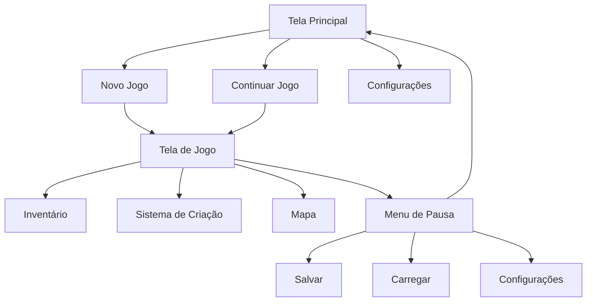
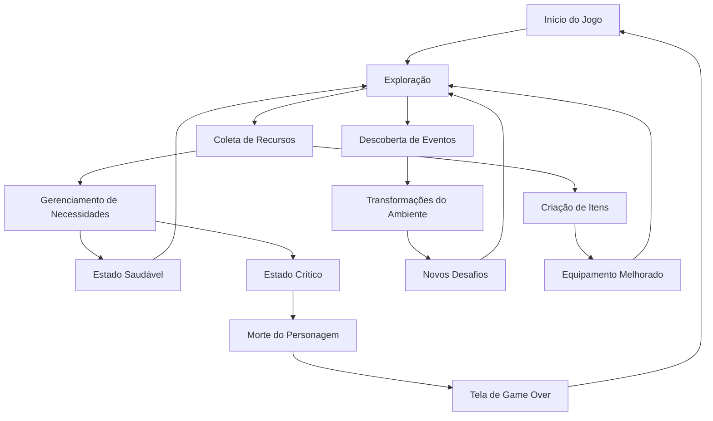

# Documento de Requisitos do Produto - Jogo de Sobrevivência em Mundo Aberto

## 1. Visão do Produto
Jogo de sobrevivência em mundo aberto desenvolvido em Unreal Engine 5 onde um jogador assume o papel de um menino que está em uma escola na ilha quando um meteoro atinge o centro da ilha, desencadeando transformações progressivas no ambiente que exigem adaptação constante do jogador.

O jogo combina mecânicas clássicas de sobrevivência com um sistema narrativo baseado em eventos ambientais, desafiando o jogador a explorar, coletar recursos, criar itens e sobreviver em um mundo em constante transformação.

## 2. Funcionalidades Principais

### 2.1 Papéis do Jogador
O jogo possui um único tipo de jogador:

| Papel | Método de Início | Permissões Principais |
|-------|------------------|----------------------|
| Jogador | Novo jogo ou continuar jogo | Explorar mundo, coletar recursos, criar itens, gerenciar inventário, progredir na história |

### 2.2 Módulo de Funcionalidades
As funcionalidades do jogo consistem nas seguintes telas principais:

1. **Tela Principal**: menu principal, novas configurações de jogo, continuação de jogos salvos.
2. **Tela de Jogo**: interface de sobrevivência, inventário, sistema de criação, mapa, configurações de pausa.
3. **Tela de Configurações**: configurações gráficas, controles, áudio.

### 2.3 Detalhes das Telas

| Nome da Tela | Nome do Módulo | Descrição da Funcionalidade |
|--------------|----------------|-----------------------------|
| Tela Principal | Menu Principal | Exibe logo do jogo, botões para novo jogo, continuar, configurações e sair com animações fluidas |
| Tela Principal | Configurações Iniciais | Permite selecionar dificuldade, personalizar controles básicos e ajustar configurações de áudio |
| Tela de Jogo | Interface de Sobrevivência | Exibe barras de vida, fome, sede, energia e temperatura com indicadores visuais de estado crítico |
| Tela de Jogo | Inventário | Mostra itens coletados em slots organizados, permite organizar, equipar e descartar itens |
| Tela de Jogo | Sistema de Criação | Exibe receitas desbloqueadas, materiais necessários e permite criar novos itens |
| Tela de Jogo | Mapa | Mostra áreas exploradas, pontos de interesse, localização atual e marcadores personalizados |
| Tela de Jogo | Menu de Pausa | Permite salvar, carregar, ajustar configurações e retornar ao menu principal |
| Tela de Configurações | Configurações Gráficas | Ajusta qualidade gráfica, resolução, efeitos visuais e configurações de desempenho |
| Tela de Configurações | Controles | Personaliza teclas de atalho, sensibilidade de mouse e configurações de gamepad |
| Tela de Configurações | Áudio | Ajusta volume de música, efeitos sonoros, ambiente e voz |

## 3. Processos Principais

### Fluxo do Jogador

O jogador inicia o jogo na tela principal, pode começar um novo jogo ou continuar um jogo salvo. Ao iniciar, o jogador começa dentro da escola na ilha, com recursos básicos limitados. O jogador deve explorar o ambiente para coletar recursos, criar ferramentas e itens essenciais, enquanto gerencia suas necessidades de sobrevivência. Conforme o tempo avança após o impacto do meteoro, o ambiente sofre transformações progressivas que introduzem novos desafios e oportunidades.

### Fluxo de Navegação de Páginas

### Fluxo de Sobrevivência

## 4. Design da Interface do Usuário

### 4.1 Estilo de Design
- **Cores Principais**: Verde escuro (#2D5016) para elementos de natureza, azul médio (#4A90A4) para elementos de água, cinza escuro (#2C2C2C) para interface base
- **Cores Secundárias**: Vermelho claro (#FF6B6B) para alertas críticos, amarelo claro (#FFE66D) para avisos, branco (#FFFFFF) para texto principal
- **Estilo de Botões**: Botões com bordas arredondadas, efeitos de hover suaves, sombras sutis para profundidade
- **Fontes**: Roboto Regular 14-16px para corpo do texto, Roboto Bold 18-24px para títulos, Roboto Medium 12-14px para labels
- **Layout**: Interface minimalista com elementos flutuantes, baseada em cards para organização de informações
- **Ícones**: Ícones lineares simplificados para representar ações e estados, consistente com estética moderna

### 4.2 Visão Geral do Design das Telas

| Nome da Tela | Nome do Módulo | Elementos de Interface |
|--------------|----------------|------------------------|
| Tela Principal | Menu Principal | Fundo com ambiente do jogo, logo centralizado, botões verticais com animações de hover, efeitos de partículas sutis |
| Tela de Jogo | Interface de Sobrevivência | HUD no canto superior direito com barras de status em gradientes, ícones coloridos, números de valores, animações de pulso em estado crítico |
| Tela de Jogo | Inventário | Grid de slots 6x8, categorização por tipo, pré-visualização de itens ao passar mouse, contadores de quantidade, botões de ação contextual |
| Tela de Jogo | Sistema de Criação | Lista de receitas à esquerda, detalhes da receita selecionada no centro, materiais necessários e quantidade disponível com cores indicadoras, botão de criação destacado |
| Tela de Jogo | Mapa | Minimapa no canto inferior esquerdo, mapa completo com áreas descobertas e ocultas, filtros por tipo de ponto de interesse, sistema de marcadores personalizáveis |
| Tela de Jogo | Menu de Pausa | Overlay semi-transparente, botões grandes centralizados, informações do jogo no topo, opções secundárias no fundo |

### 4.3 Responsividade
O jogo é desenvolvido principalmente para desktop, mas suporta:
- **Adaptação de Resolução**: Suporte nativo para resoluções de 1920x1080 até 4K
- **Otimização para Monitores Múltiplos**: Suporte para configurações multi-monitor
- **Suporte a Controle**: Interface adaptável para gamepad com navegação por d-pad
- **Acessibilidade**: Opções de redimensionamento de UI, cores para daltonismo, legendas e suporte a leitores de tela

## 5. Mecânicas de Jogo Detalhadas

### 5.1 Sistema de Sobrevivência
- **Vida**: Diminui com dano físico, venenos ou condições extremas. Regenera lentamente quando as outras necessidades estão satisfeitas
- **Fome**: Diminui gradualmente com o tempo. Causa dano progressivo quando crítica. Alimentação é necessária para manter níveis saudáveis
- **Sede**: Diminui mais rápido que fome. Causa danos severos e reduz eficácia de ações. Água potável é essencial
- **Energia**: Diminui com atividades físicas e regenera com descanso. Afeta velocidade de movimento e eficiência de ações
- **Temperatura**: Afetada pelo clima e ambiente. Temperaturas extremas causam dano e alteram consumo de energia

### 5.2 Sistema de Exploração
- **Mapa do Mundo**: Ilha com biomas variados (floresta, praia, montanhas, ruínas urbanas)
- **Pontos de Interesse**: Edifícios abandonados, cachoeiras, cavernas, acampamentos de sobreviventes anteriores
- **Sistema de Dia/Noite**: Ciclo de 24 minutos (1 minuto = 1 hora), afetando visibilidade, comportamento de criaturas e temperatura
- **Clima Dinâmico**: Chuva, tempestades, neblina, céu claro, afetando visibilidade e sobrevivência

### 5.3 Sistema de Criação e Recursos
- **Recursos Básicos**: Madeira, pedra, fibras, água, alimentos, metal, minérios
- **Ferramentas**: Faca, machado, picareta, martelo, recipiente de água
- **Itens de Sobrevivência**: Tenda, fogueira, armaduras simples, armadilhas
- **Progressão**: Desbloqueio de receitas mais complexas conforme experiência e recursos coletados

### 5.4 Sistema de Transformação Ambiental
- **Fase 1 (0-24 horas)**: Destruição imediata, caos, acessibilidade limitada
- **Fase 2 (1-3 dias)**: Estabilização parcial, novos recursos expostos, surgimento de criaturas
- **Fase 3 (4-7 dias)**: Transformação biológica, flora mutante, clima alterado
- **Fase 4 (8+ dias)**: Novo ecossistema estável, desafios avançados, segredos revelados

### 5.5 Sistema de Progressão
- **Experiência**: Ganha através de exploração, sobrevivência, descobertas
- **Níveis de Habilidade**: Melhorias em velocidade, eficiência de coleta, resistência
- **Descobertas**: Desbloqueio de receitas, áreas especiais, partes da história
- **Marcos Narrativos**: Eventos específicos que avançam a história do jogo

## 6. Interface de Usuário Avançada

### 6.1 HUD Principal
- **Indicadores de Status**: Barras coloridas com valores numéricos
- **Minimapa**: Mostra área imediata com pontos de interesse
- **Inventário Rápido**: Barra de atalhos para itens frequentemente usados
- **Relógio e Clima**: Indicador de hora atual e condições climáticas
- **Notificações**: Mensagens pop-up para eventos importantes, descobertas e alertas

### 6.2 Menus Contextuais
- **Menu de Interação**: Opções baseadas no contexto (interagir com objetos, NPCs, ambiente)
- **Menu de Crafting**: Acesso rápido a receitas com materiais disponíveis
- **Menu de Gerenciamento**: Organização de inventário, equipamento e configurações

### 6.3 Sistemas de Feedback
- **Feedback Visual**: Animações de ações, efeitos de partículas, mudanças de cor
- **Feedback Sonoro**: Sons de ambiente, efeitos de ações, música adaptativa
- **Feedback Tátil**: (Opcional) Vibração de control para eventos importantes